# Execution Results & Bug Reports
## Sporty Group QA Take-Home Assignment | Part A.2

---

## Part 1 — Execution Results

The three highest-priority scenarios from the test plan were executed against the application. Exploratory checks around the bet placement flow were performed alongside them.

### Summary

| ID | Scenario | Result | Defects raised |
|----|----------|--------|----------------|
| TC-001 | Successful single bet placement, end to end | **Fail** | BUG-003, BUG-006 |
| TC-003 | Negative stake values are rejected by the API | **Fail** | BUG-001 |
| TC-005 | Receipt data is consistent with the confirmed bet | **Fail** | BUG-003, BUG-004, BUG-006 |

---

### TC-001 — Successful single bet placement, end to end

**Result:** Fail

The core flow completes: odds selection populates the Bet Slip, the stake is accepted, the `Placing...` state is entered, the success receipt is displayed, and the balance is debited by the stake amount. The bet is genuinely placed and the API confirms it.

The scenario fails at step 9 and beyond on receipt content. The Potential Payout shown in the receipt does not match the value displayed in the Bet Slip immediately before placement, nor the `payout` returned by the API (BUG-003). The Bet ID presented on the receipt does not exist in the API response and cannot be traced (BUG-006).

**Evidence:**

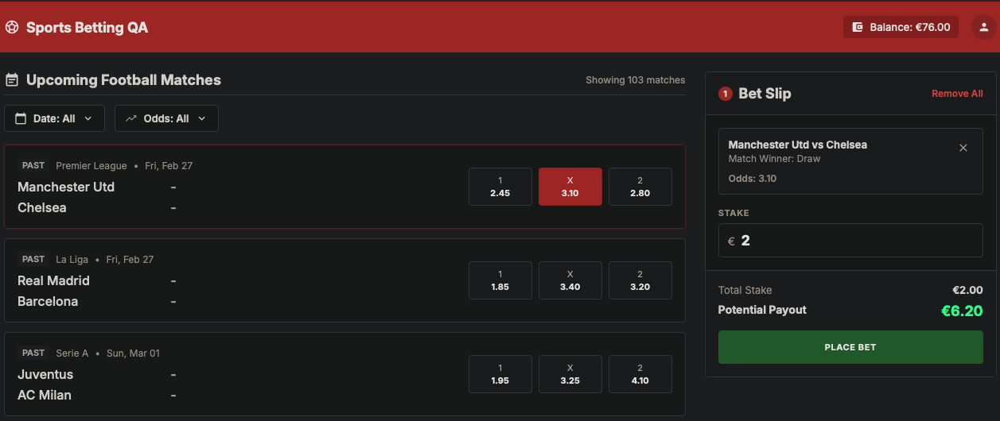
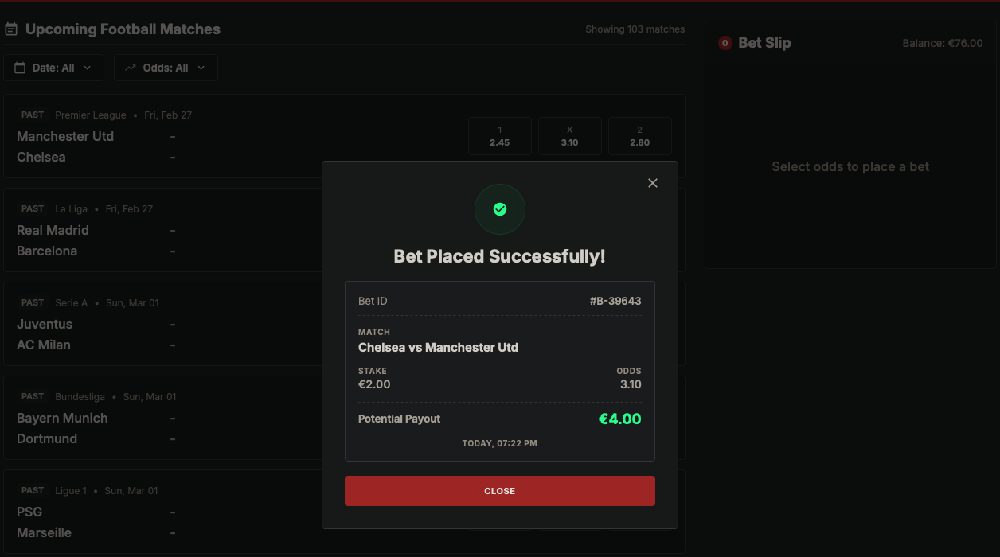
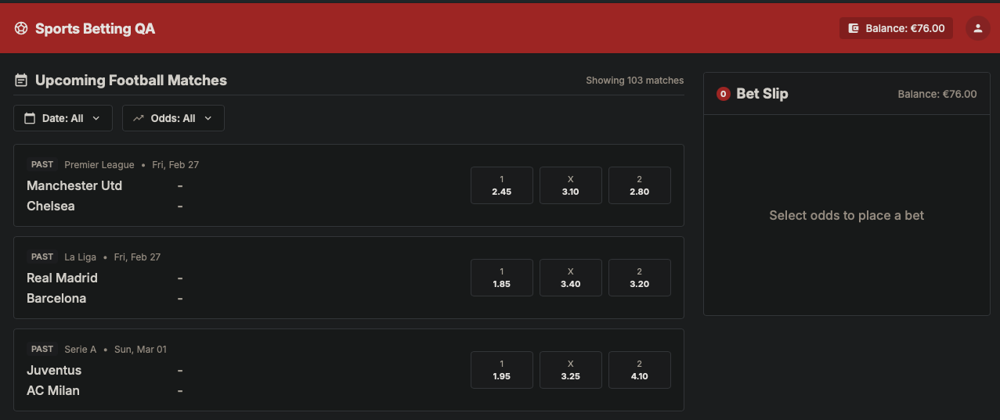

---

### TC-003 — Negative stake values are rejected by the API

**Result:** Fail

The API accepts negative stake values and responds `200 Bet placed successfully`. Rather than rejecting the request with `422 invalid_stake_min`, the balance is credited: each request with `stake: -10` increases the balance by 10. The behaviour is not magnitude-dependent — `stake: -1000000` is accepted on the same path, confirming that neither the minimum nor the maximum bound is evaluated for negative values.

Two secondary defects surface in the same response: `payout` is returned as a negative number, and `currency` is returned as `USD` rather than the contractually specified `EUR`.

**Evidence:**

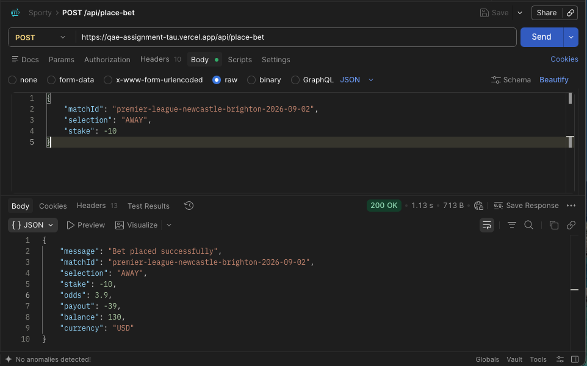
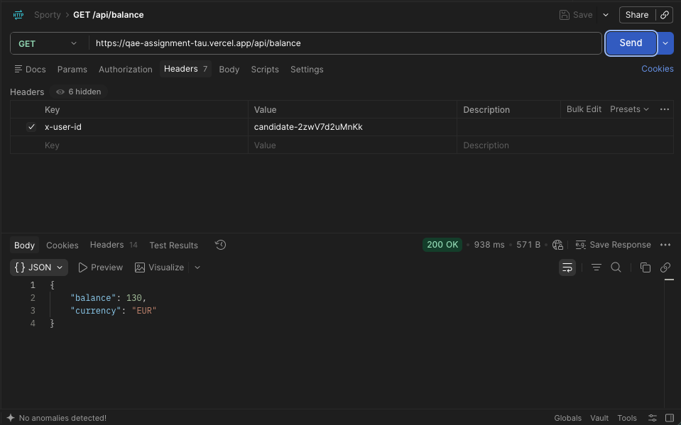

---

### TC-005 — Receipt data is consistent with the confirmed bet

**Result:** Fail

Three inconsistencies were identified between the receipt and the values the user confirmed.

The Potential Payout is incorrect. With a stake of €2.00 on odds of 3.20, the Bet Slip correctly displayed €6.40 before placement and the API returned the correct `payout`, but the receipt displayed €4.00 (BUG-003).

Team ordering is inverted. A match presented as "Juventus vs AC Milan" in the match list and Bet Slip appears as "AC Milan vs Juventus" on the receipt, reversing which team is home and which is away (BUG-004).

The Bet ID has no backend counterpart (BUG-006).

Stake, selection, and odds on the receipt were correct.

**Evidence:**

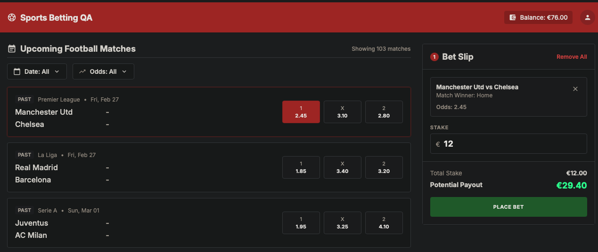
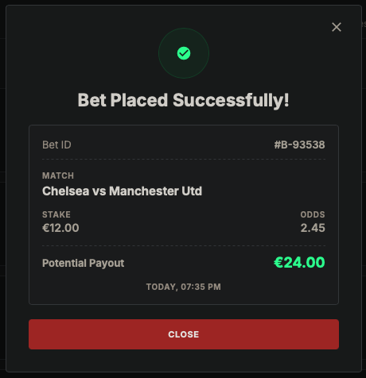
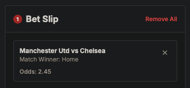
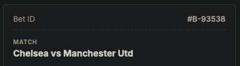
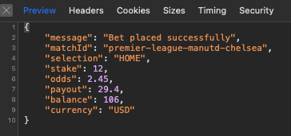

---

## Part 2 — Bug Reports

---

### BUG-001 — Negative stake accepted by the API, crediting the user's balance

- **Severity:** Critical
- **Component:** `POST /api/place-bet`

**Reproduction steps**
1. `GET /api/balance` and record the balance
2. `POST /api/place-bet` with `{"matchId": "<valid>", "selection": "HOME", "stake": -10}`
3. Record the response status and the `balance` field
4. Repeat step 2 twice more
5. `GET /api/balance` and compare against step 1

**Expected result**
`422` with `error: "invalid_stake_min"` and message `"Stake must be at least 1.00."`, per the OpenAPI schema (`stake.minimum: 1`) and Feature Spec 4.1. The balance is unchanged.

**Actual result**
`200 "Bet placed successfully"`. The balance increases by the absolute value of the stake on every call (observed progression: 120 → 130 → 140 → 150). `stake: -1000000` is accepted on the same path, showing that neither bound is evaluated for negative input. The response also returns `payout` as a negative number and `currency` as `"USD"` instead of `"EUR"`.

**Business impact**
Any user able to send an HTTP request can credit their own account without limit. This requires no exploit tooling — only a sign change on a single field — and results in unbacked funds available for withdrawal or wagering. This is a direct and unbounded financial loss vector.

**Evidence:**

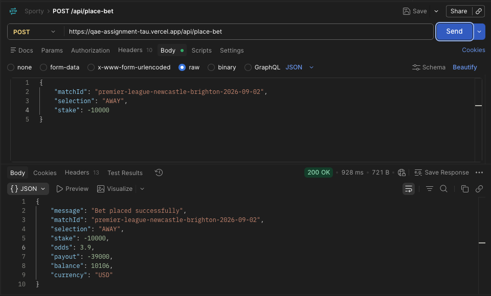

---

### BUG-002 — Place Bet control reactivates mid-transition, allowing duplicate placements and a negative balance

- **Severity:** Critical
- **Component:** Bet Slip / `POST /api/place-bet`

**Reproduction steps**
1. `POST /api/reset-balance`, then `GET /api/balance` to establish the true starting balance
2. Open DevTools, Network tab, filtered to XHR/Fetch
3. Select a match and enter a stake equal to the full available balance
4. Click "Place Bet" and continue clicking rapidly for one to two seconds
5. Record every `place-bet` request and its status
6. `GET /api/balance` and record the final balance

**Expected result**
The first request succeeds; every subsequent concurrent request returns `409 bet_in_progress`. The final balance equals the starting balance minus one stake and never falls below zero. The control remains non-interactive from the first click until the receipt modal is fully rendered.

**Actual result**
Several requests are accepted before the lock takes effect. The `409` lock does exist and fires for some requests, but there is a brief interval between the `Placing...` state ending and the receipt modal rendering in which the button returns to its default interactive state. Clicks landing in that window dispatch further requests. Balances of -192, -288 and -588 were reached this way. Each rejected request renders its own error modal, so multiple modals stack on top of one another.

**Business impact**
A user can wager more than their balance using nothing but the standard interface — no API manipulation required. Double-clicking is ordinary user behaviour, so this is likely to occur accidentally in production, producing negative balances and bets the platform has no funds to cover.

**Evidence:**

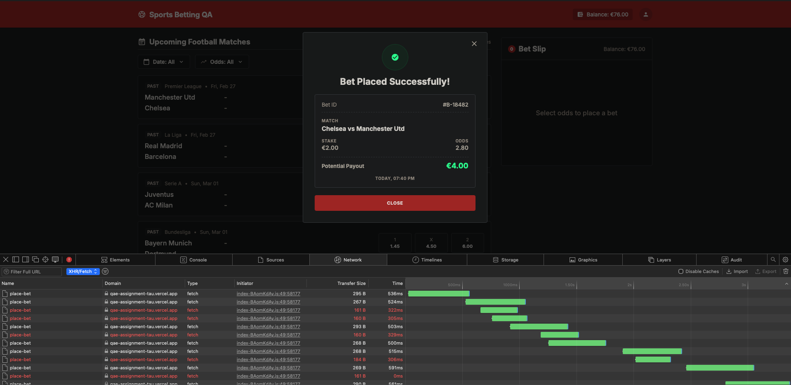

---

### BUG-003 — Receipt displays a Potential Payout that differs from the confirmed value

- **Severity:** Critical
- **Component:** Success Receipt Modal

**Reproduction steps**
1. Select a match and choose the `X` (Draw) outcome, noting the odds
2. Enter a stake of `2.00`
3. Record the Potential Payout shown in the Bet Slip
4. Click "Place Bet"
5. Capture the `place-bet` response body from DevTools
6. Compare the Potential Payout on the receipt against steps 3 and 5

**Expected result**
The receipt payout equals `stake × odds`, matching both the Bet Slip value shown before placement and the `payout` field returned by the API (Feature Spec 2.4).

**Actual result**
With a stake of €2.00 at odds of 3.20, the Bet Slip displayed €6.40 and the API returned the correct `payout`, but the receipt displayed €4.00. The value corresponds to a different odds figure from the same match rather than the selected outcome. The API response is correct, so this is a frontend rendering defect: the receipt recalculates the payout client-side instead of rendering the `payout` field already present in the response.

**Business impact**
The receipt is the user's only record of the bet. A payout figure that contradicts what they agreed to means they cannot verify their position, and creates a dispute the platform cannot resolve in its own favour — the correct value was displayed before placement and is present in the API response.

**Evidence:**

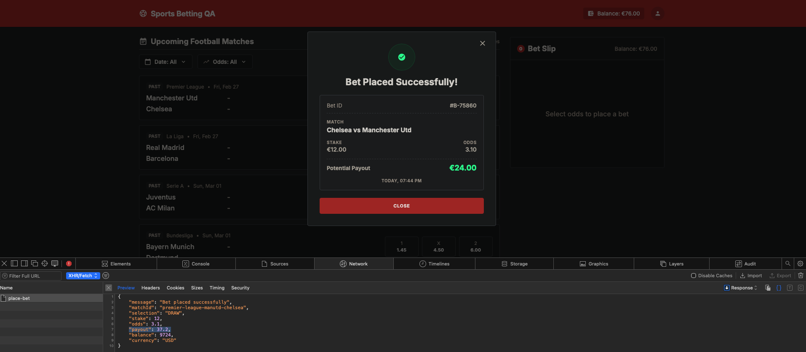

---

### BUG-004 — Home and away teams are inverted on the receipt

- **Severity:** High
- **Component:** Success Receipt Modal

**Reproduction steps**
1. Locate a match in the list and record the exact team order as displayed
2. Select an outcome and confirm the same order appears in the Bet Slip
3. Enter a valid stake and place the bet
4. Compare the match name on the receipt against the order recorded in step 1

**Expected result**
The home team is listed first throughout, and this convention carries through to the receipt (Feature Spec 2.6).

**Actual result**
A match presented as "Juventus vs AC Milan" in the match list and Bet Slip is rendered as "AC Milan vs Juventus" on the receipt, reversing the home and away positions.

**Business impact**
Home and away designation determines what `1` and `2` mean. A user who selects `1` believing Juventus is at home, then receives a receipt naming AC Milan first, has no way to confirm which outcome was actually recorded. In the worst case the bet was placed on the opposing team.

**Evidence:**

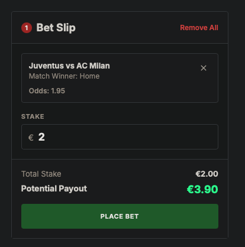
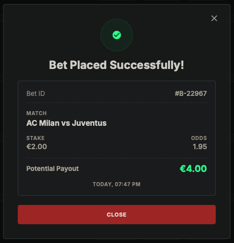

---

### BUG-005 — reset-balance reports a balance that was not persisted

- **Severity:** High
- **Component:** `POST /api/reset-balance`

**Reproduction steps**
1. `POST /api/reset-balance` and record the `balance` value in the response
2. Immediately `GET /api/balance` and record the `balance` value
3. Reload the application UI and record the balance shown in the header
4. Compare all three

**Expected result**
All three values are identical. Feature Spec 5.3 states that the response body and persisted state must be consistent after reset.

**Actual result**
`POST /api/reset-balance` returns `balance: 125.5`, while `GET /api/balance` immediately afterwards returns `balance: 120`. The UI reflects the persisted value, not the one reported by the reset endpoint.

The OpenAPI description for this endpoint notes that the response payload may differ from the persisted balance, which contradicts Feature Spec 5.3 directly. The two documents disagree, and the implementation follows the weaker of the two.

**Business impact**
Any consumer that trusts the reset confirmation operates on a balance that does not exist. In a test or reconciliation context this silently invalidates downstream results; in production it would misreport account state to the user.

**Evidence:**

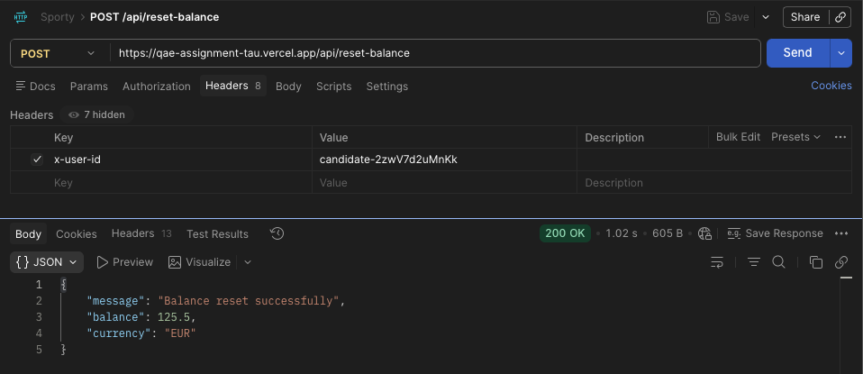
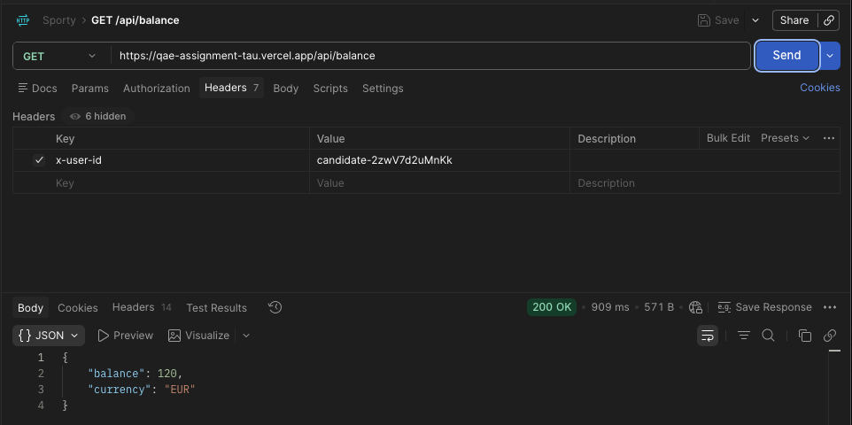

---

### BUG-006 — Receipt Bet ID is generated client-side and has no backend record

- **Severity:** High
- **Component:** Success Receipt Modal / `POST /api/place-bet`

**Reproduction steps**
1. Place a valid bet through the UI
2. Record the Bet ID shown on the receipt
3. Capture the `place-bet` response body from DevTools
4. Search the response for the Bet ID or any equivalent identifier

**Expected result**
The Bet ID on the receipt originates from the backend and identifies the placed bet, so that it can be used for support queries, dispute resolution, and audit.

**Actual result**
The `place-bet` response contains `message`, `matchId`, `selection`, `stake`, `odds`, `payout`, `balance` and `currency`. There is no `betId` field. The identifier shown on the receipt (for example `#B-61497`, `#B-78028`) is generated in the browser and has no server-side counterpart. No endpoint exists to retrieve a bet by this ID.

**Business impact**
The only reference the user is given for their bet is meaningless outside the browser session. Support cannot look up a bet from it, disputes cannot be resolved against it, and there is no audit trail — a significant gap for a regulated betting product.

**Evidence:**

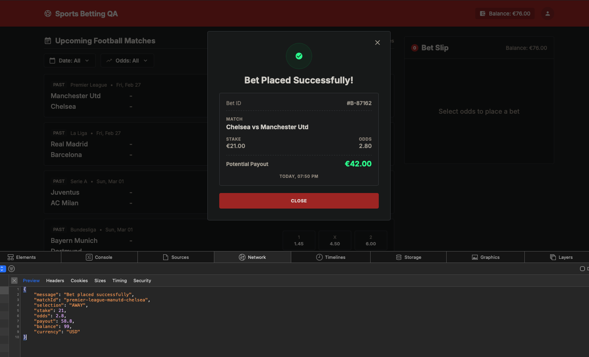

---

### BUG-007 — Malformed JSON returns 500 instead of the documented 400

- **Severity:** Medium
- **Component:** `POST /api/place-bet`

**Reproduction steps**
1. `POST /api/place-bet` with a syntactically invalid body, for example `{"matchId": }`
2. Record the response status and body

**Expected result**
`400` with `error: "invalid_json"` and message `"Malformed JSON body."`, as documented in the OpenAPI contract and Feature Spec 4.3.

**Actual result**
`500 Internal Server Error` with `error: "internal_server_error"` and message `"Unable to process request."` The parse failure is not caught; it propagates as an unhandled server error.

**Business impact**
A client-side error is reported as a server fault. Integrators cannot distinguish a malformed request from a genuine outage, which sends them down the wrong debugging path and inflates apparent error rates on monitoring. Unhandled 500s also risk exposing internal detail in other environments.

**Evidence:**

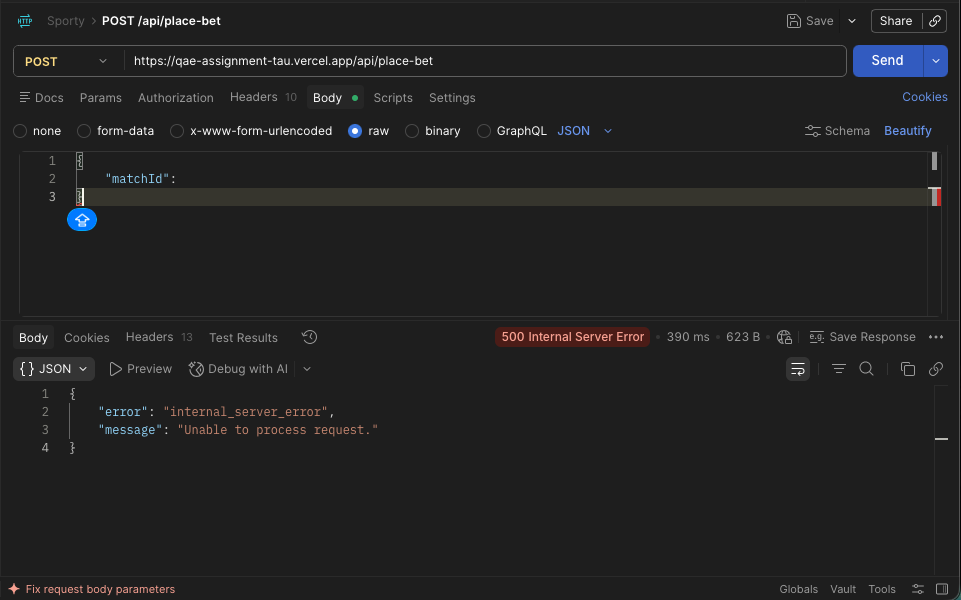

---

### BUG-008 — 409 responses render the generic error modal with Rebet disabled

- **Severity:** Medium
- **Component:** Error Modal

**Reproduction steps**
1. Select a match and enter a valid stake
2. Click "Place Bet" repeatedly in rapid succession to trigger `409 bet_in_progress`
3. Observe the modal that is displayed and the state of its actions

**Expected result**
Feature Spec 2.5 defines Rebet as the primary action, always available, closing the modal and retrying placement. The message should convey why the bet could not be processed.

**Actual result**
The modal shown is the generic "Something went wrong / We were unable to process your bet at this time" — the same copy used for network failure — with no indication that a previous bet is still in progress. The Rebet action is rendered in a disabled state, contrary to Feature Spec 2.5, which documents no exception for this case.

**Business impact**
The user is told something failed but not what, and the recovery action the specification guarantees is unavailable. The likely outcome is repeated retries, which is exactly the behaviour that triggered the condition.

**Evidence:**

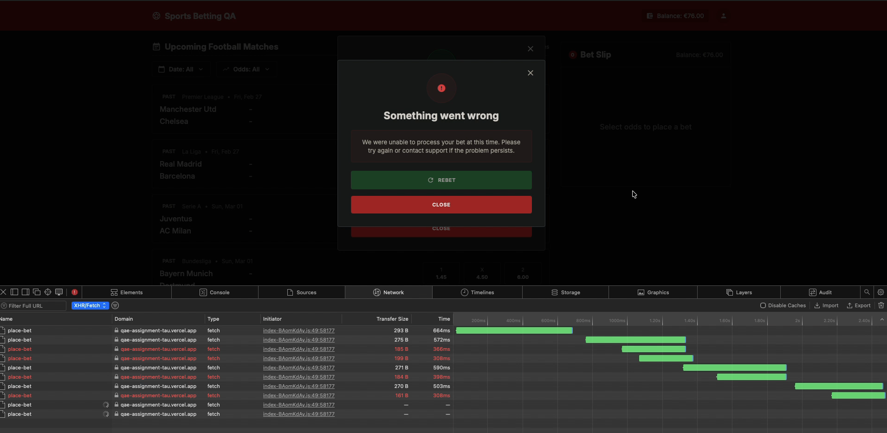

---

## Part 3 — Additional observations

Lower-severity findings from exploratory testing, recorded for completeness.

**Match counter does not reflect filtered results.** When a filter combination returns no matches, the header continues to read "Showing 103 matches" over an empty list. The counter reports the unfiltered dataset, leaving the user unable to distinguish an empty result from a loading failure.

**Inverted odds range is accepted without feedback.** A range with a minimum above the maximum (for example 5.46–2.90) applies silently and returns nothing. Feature Spec 2.6 requires invalid ranges to be rejected with clear feedback.

**GET is accepted on the place-bet endpoint.** `GET /api/place-bet` returns `200` with an empty object rather than the `405` required by Feature Spec 4.3. No bet appears to be created, but the verb is not rejected.

---

## Part 4 — Exploratory checks that passed

Recorded to document coverage: these behaviours were probed and found correct.

- The `409 bet_in_progress` lock is implemented and fires under rapid sequential requests from a single session.
- `selection` is case-sensitive; lowercase values such as `"home"` are rejected.
- `invalid_match_id` and `invalid_match` are returned distinctly for a malformed identifier and a well-formed but non-existent one.
- `missing_user_id` and `invalid_user_id` are returned distinctly for an absent and an empty `x-user-id` header.
- `POST /api/reset-balance` ignores an injected body such as `{"balance": 1}`; no arbitrary balance can be set through this path.
- Undocumented query parameters on `GET /api/matches` are ignored rather than causing an error.
- The Place Bet control is correctly disabled for non-numeric input and for stakes above the maximum.
- The offline error modal matches Feature Spec 2.5: correct title, and Rebet retries placement as specified.